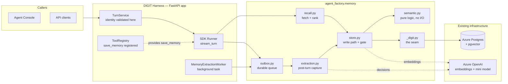
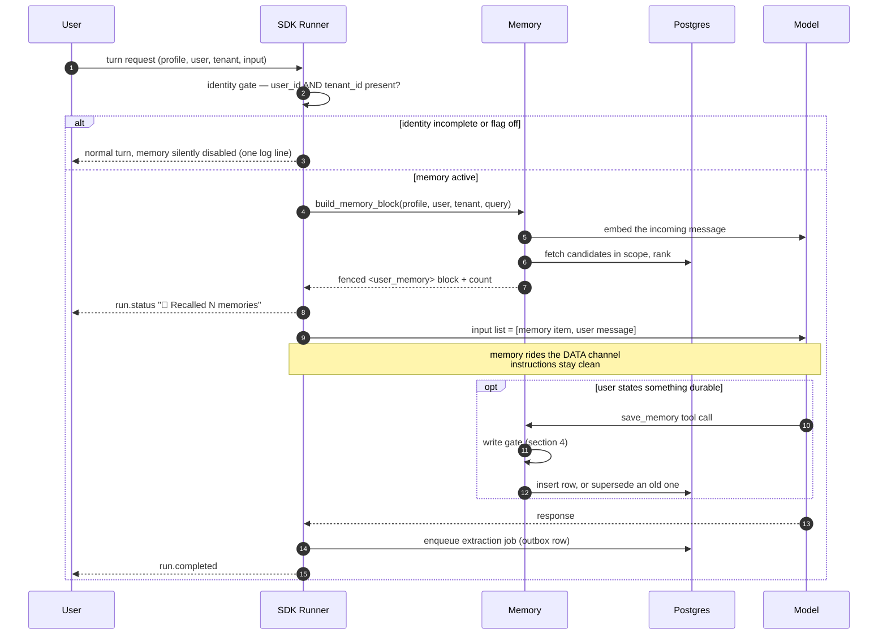
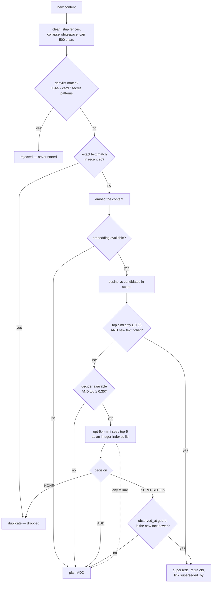
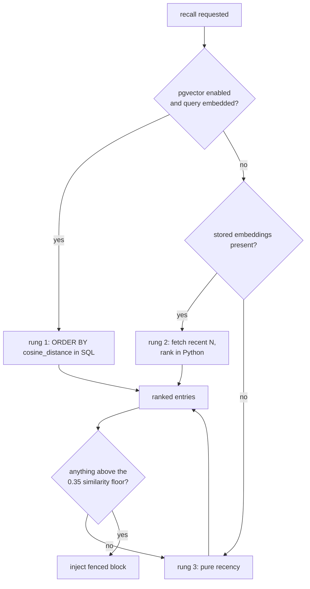
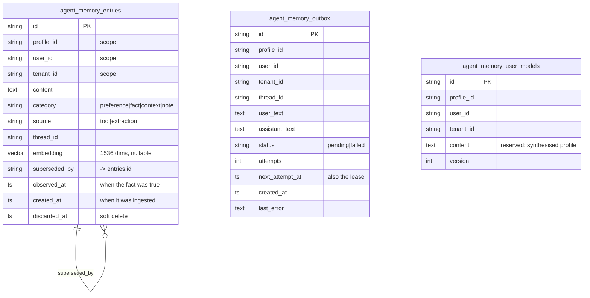
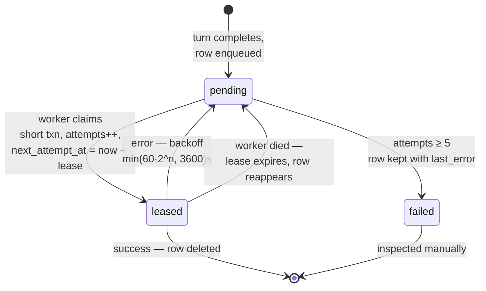
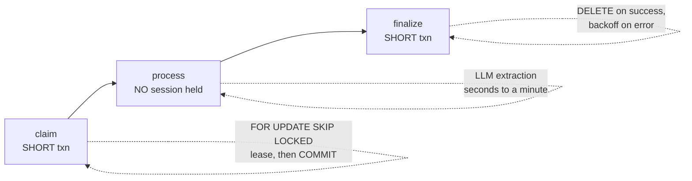
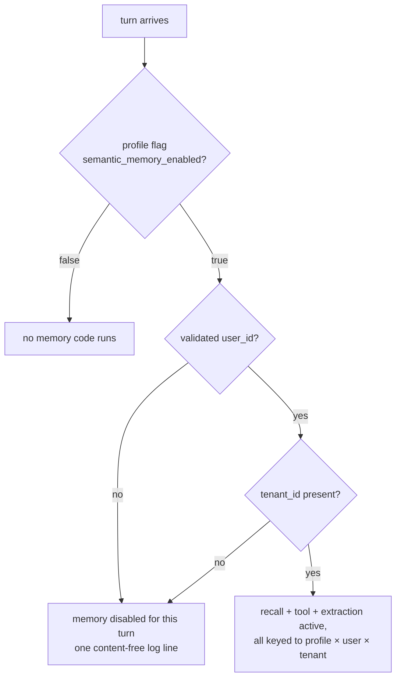
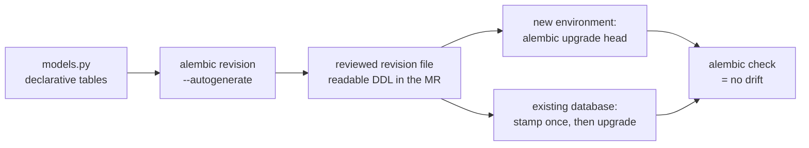

# Agent Memory — Architecture Reference

**The definitive description of the system as it stands today**, on branch `feature/agentmemory-v3`. Diagrams render natively in GitHub and GitLab. If you read one document about this feature, read this one.

- Audience: anyone on the DIGIT AI Engineering team.
- Companion docs: [SHOWCASE.md](SHOWCASE.md) (5-minute overview) · [TECHNICAL_DEEP_DIVE.md](TECHNICAL_DEEP_DIVE.md) (file-by-file reference) · [MIGRATIONS.md — on the harness branch] (schema operations) · [research/INDUSTRY_PRACTICES.md](research/INDUSTRY_PRACTICES.md) (what production systems do and what we adopted).

---

## 1. What this is, in one paragraph

DIGIT agents have session memory: a transcript that lives for one thread and dies with it. This feature adds **agent-level persistent memory** — durable facts about a specific user (preferences, corrections, working context) that survive new threads and backend restarts, scoped per agent × user × tenant, stored in the Azure Postgres the harness already runs, and **off by default** behind a single profile flag. The goal is compounding value: the more a person uses an agent, the better that agent fits them, with no effort from the user.

## 2. System context

Memory is a package **inside** the harness runtime — not a service, not a sidecar. It shares the app's database connection pool, its model-call conventions, and its lifecycle.

**The seam (`_digit.py`) is the only file that touches harness symbols.** Everything else in the package is portable and unit-testable off-harness. At app construction the harness installs its own `Database.session_factory` into the seam, so in-app memory creates **no database engine of its own**; a fallback engine exists solely for standalone scripts, and logs which mode it is in.

## 3. Anatomy of one turn

Two properties fall out of this shape:

- **Recall can never break a turn.** Any failure returns no block and the turn proceeds; the user simply gets an agent with no memory that turn.
- **The injected memory item is never persisted into conversation history.** A session wrapper (`session_filter.py`) drops it on the way to storage, so it cannot accumulate in `agent_messages` turn after turn. Recall re-injects fresh every turn, which is the intended behaviour.

## 4. The write gate

Every write — tool save or background extraction — passes through the same gate. Most of it is free; the model is only consulted for genuinely ambiguous cases.

**The 0.30 floor is measured, not borrowed.** A real changed-preference contradiction ("exactly three bullet points" → "five bullets now, not three") measured **cosine 0.309** on `text-embedding-3-large` at 1536 dimensions — far below the 0.70 band the literature suggests, which would have silently missed it. Every write emits one content-free telemetry line (`memory gate: top_sim=… tier=… action=…`) so future tuning stays data-driven.

**Failure always degrades toward ADD.** An extra row on an append-only table is harmless; a wrongly superseded fact is not.

## 5. Retrieval and ranking

Candidates are scored `0.7 × similarity + 0.3 × exp(−age_days / 30)`, with a minimum-similarity floor of 0.35 so weak matches are never injected just for being top-k, plus a small recency floor of always-included recent items. Up to 20 entries / 8,000 characters are injected per turn.

Retrieval degrades in three rungs rather than failing:

No ANN index exists by design: within an already scope-filtered set, an exact cosine scan is both faster and 100% recall at this size. HNSW is documented as the growth step once a single scope exceeds tens of thousands of rows.

## 6. Data model

Design notes worth knowing:

- **`observed_at` vs `created_at` are deliberately different.** One is when the fact became true, the other when we learned it. The supersede guard compares event time, so an older fact can never overwrite a newer one.
- **Nothing is ever hard-deleted at runtime.** `discarded_at` retires a row; `superseded_by` records what replaced it. The chain *is* the audit trail.
- **`agent_memory_user_models` ships empty.** It is the reserved home for consolidated per-user profiles — the direction ChatGPT, Claude and Gemini are all converging on.

## 7. Durable extraction: the outbox

Background extraction used to be fire-and-forget: if the process died between a turn ending and extraction finishing, that memory was lost — and one newer harness completion path skipped it entirely. Now every eligible turn **durably enqueues** a job, and a worker drains it.

The worker copies the harness's own `ProfileHealthMonitor` pattern: a service object started in the app lifespan and stopped **before** the databases close. Its cycle is deliberately three separate short transactions:

That ordering matters: model calls never happen inside an open transaction, so a slow extraction can never hold a pooled connection or a row lock. Delivery is **at-least-once**; the write gate's dedup makes replays harmless.

**Verified end to end:** a turn was enqueued with the worker disabled, the server was killed, and on restart the worker drained the backlog (`memory outbox: processed=4 failed=0`, outbox empty) and the next turn recalled the new memory.

## 8. Identity and scoping

Fail-closed by construction: the same predicate gates recall, extraction, and the tool (the tool is gated implicitly — it is enabled through the same run-context flag, so no tool-side change was needed). Harness paths no longer fall back to a `"default"` tenant sentinel.

> **Current consequence, by design:** the console does not send a tenant yet, so console-driven memory is inert on this branch until the tenant plumbing lands with the governed-API workstream. That satisfies the review's condition that memory stay demo-only until governance ships.

## 9. Schema deployment

Schema is versioned with Alembic — introduced to the harness as part of this work, with the memory tables as its first revision.

- Revision `5258f2433fcb` is a reviewed baseline of the **entire** harness schema, including the memory tables and a `CREATE EXTENSION IF NOT EXISTS vector` guard.
- Revision `6f4f8e6f7f55` adds the outbox table — the framework's first real incremental change.
- `create_all` survives only as local/test bootstrap and is documented as such.
- Because the dev database is **shared with another application**, Alembic is scoped to harness-owned tables: the `studio_*` tables and the SDK-managed `agent_sessions` / `agent_messages` are deliberately unmanaged, as is one hand-applied index on `agent_runs` that exists in the database with no owner in code (flagged for the team to decide on).

## 10. Configuration

| Setting | Where | Default | Purpose |
|---|---|---|---|
| `memory.semantic_memory_enabled` | agent profile YAML | `false` | The master switch, per agent |
| `AGENT_FACTORY_MEMORY_PGVECTOR` | env | off | Use `vector(N)` column instead of packed bytes |
| `AGENT_FACTORY_MEMORY_EMBED_MODEL` | env | `text-embedding-3-large` | Embedding deployment |
| `AGENT_FACTORY_MEMORY_EMBED_DIM` | env | `1536` | Dimensions requested from the embedder |
| `AGENT_FACTORY_MEMORY_MODEL` | env | harness default | Model for gate decisions and extraction |
| `AGENT_FACTORY_MEMORY_OUTBOX_ENABLED` | env | `true` | Run the extraction worker |
| `AGENT_FACTORY_MEMORY_OUTBOX_INTERVAL_SECONDS` | env | `3.0` | Worker poll interval |
| `AGENT_FACTORY_MEMORY_QUIET` | env | off | Silence the package's own log handler |

## 11. Failure modes

| If this fails | The system does | User-visible effect |
|---|---|---|
| Embedder unavailable | Recall drops to recency; writes store `embedding NULL` and can be backfilled | Slightly less relevant recall |
| Decision model unavailable | Gate degrades to plain ADD | A possible duplicate row, never a lost fact |
| Database unavailable at recall | Returns no block | Agent behaves as if it has no memory |
| Database unavailable at enqueue | Falls back to the old in-process extraction | Behaviour no worse than before the outbox |
| Worker dies mid-job | Lease expires, row is reclaimed | Extraction happens a few minutes later |
| Identity incomplete | Memory disabled for that turn | No memory, one log line, turn unaffected |

## 12. Security and governance posture

- **Off by default**, enforced by a test that fails the build if any non-test profile enables memory.
- **Fail-closed identity**: no validated user *and* tenant, no memory.
- **Denylist at write time**: IBAN-shaped strings, card-shaped digit runs, and password/secret/API-key/token patterns are blocked by pattern, independent of what the extraction prompt is told.
- **Content-free logging**: ids, counts, outcomes — never memory text.
- **Injection-aware**: the recalled block is fenced and explicitly framed as *stored data, not instructions — if it conflicts with the user, the user wins*; any attempt to forge that fence inside stored content is stripped at write time; and as of the injection-boundary change, memory no longer travels in the instruction channel at all.
- **Deletable**: soft delete per entry, one-call `forget_user()` cascade per scope, supersede chains preserved as audit. Retention windows and a scheduled hard purge are the next workstream.

## 13. Status

| Workstream | State |
|---|---|
| Core memory (recall, tool, extraction) | Built, demoed, live-verified |
| Semantic retrieval + supersede (pgvector) | Built, live-verified, thresholds calibrated |
| Re-base onto current dev | Done — branch `feature/agentmemory-v3` |
| Alembic migrations, verified drift-free | Done |
| Harness-managed DB lifecycle | Done — no private engine in-app |
| Identity and tenant hardening | Done — fail-closed |
| Test coverage incl. off-by-default guard | Done |
| **Merge candidate 1 (foundation)** | **In review** — branch `feature/agentmemory-mc1` |
| Recall out of the instruction channel | Done |
| Durable extraction (outbox + worker) | Done |
| Governed APIs, audit events, retention | Built; API layer being fixed (see below) |
| Console tenant plumbing | Next — this is what re-enables memory in the console |
| Consolidation into per-user profiles | Designed, deferred |

**Branch topology.** `feature/agentmemory-mc1` is a frozen snapshot of the foundation work, open as a merge request; nothing new lands on it. All candidate-2 work continues on `feature/agentmemory-v3`, so pushes there cannot disturb the review.

**Known open item.** The governance endpoints are implemented and their migration is applied, but the routes were written as synchronous handlers bridging into async store calls, which creates a second event loop and breaks connections borrowed from the app's pool (`got Future attached to a different loop`). The fix is to declare the routes `async def` and await the store functions directly. That work is uncommitted on `feature/agentmemory-v3` and is not in any merge request.

## 14. Glossary

| Term | Meaning |
|---|---|
| **Scope** | The `(profile_id, user_id, tenant_id)` triple every row is keyed by |
| **The seam** | `_digit.py`, the only module that touches harness symbols |
| **The gate** | The tiered checks every write passes before storage |
| **Supersede** | Retire a row and link it to its replacement, instead of overwriting |
| **The outbox** | The durable queue that makes post-turn extraction crash-safe |
| **Recall block** | The fenced `<user_memory>` item injected into the model input |
| **Lease** | The future `next_attempt_at` set at claim time so a dead worker's rows return |
