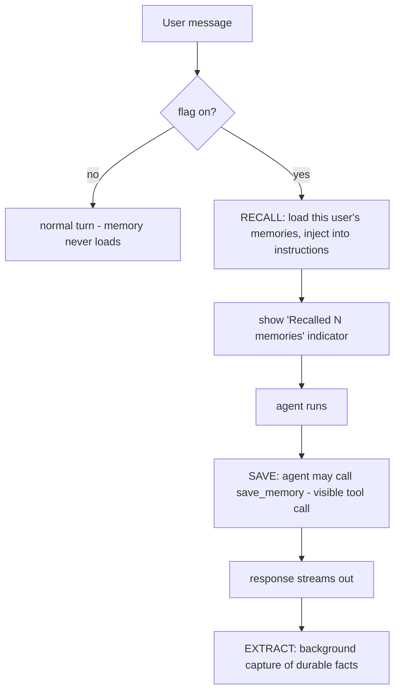
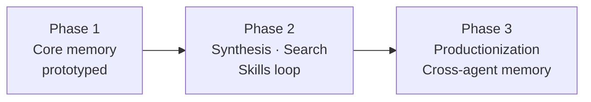

# Agent Memory for DIGIT — Design Review & Roadmap

**Presenter:** Anshuman · **For:** design feedback before finalizing
**Status:** core prototyped; seeking input on design + roadmap before the Friday walkthrough

---

## Why we're here

I've designed (and built a working proof-of-concept of) agent-level persistent memory for DIGIT, and I want your feedback on the **design decisions** and the **roadmap** before I lock it in and demo it Friday. This doc is the design on one page, the tradeoffs I made and why, and the phased plan for where it goes next.

---

## The opportunity

DIGIT agents forget everything between conversations. Chat history is stored per *thread* — open a new conversation and the agent knows nothing about you: not your preferences, your role, or how you like to work. There's already a `semantic_memory_enabled` flag on every agent profile, but it's inert. This is the system behind that flag.

**The distinction that matters:** history is the transcript of one thread. *Memory* is a small, curated set of facts re-injected into every new conversation. They're different tables and different lifecycles.

---

## Proposed approach

Adapt the memory **lifecycle** from Hermes Agent (the open-source reference), but swap its on-disk files for DIGIT's existing Postgres and scope everything per (agent, user). Four beats, all gated by the per-agent flag:

- **Recall** (pre-turn): inject the user's memories into the agent's instructions.
- **Save** (mid-turn): a `save_memory` tool the agent calls deliberately.
- **Extract** (post-turn): a background step captures durable facts automatically.
- **Gate:** flag off ⇒ nothing runs, the code doesn't even load.

**Storage:** two new tables in the existing Postgres. No new infrastructure, no vector DB (deliberately — see roadmap).

---

## Key design decisions (and the tradeoffs)

| Decision | Why | Tradeoff accepted |
|---|---|---|
| **Scope per (agent, user)** | matches the personalization goal — each agent remembers each user | cross-agent/user-wide memory deferred as a bigger question |
| **Postgres, not files or vectors** | reuse what we have; the profile dir is ephemeral, the DB is durable | no semantic search in v1 (load-recent is enough at this scale) |
| **Opt-in per agent** via the existing flag | zero risk to agents that don't want it | each agent must opt in explicitly |
| **Memory is subordinate to live input** | on a shared multi-user platform, recalled text must never act as instructions | slightly more conservative recall behavior |
| **Two write paths** (explicit tool + auto-extraction) | the agent can save deliberately *and* capture passively | extraction adds one small post-turn model call |
| **Append-only + soft-delete** | the log doubles as an audit trail; "forget" is one UPDATE | storage grows until a retention policy is set |
| **Grounded in prior art** (Hermes, Letta, mem0, OpenClaw) | proven patterns, not invented | had to adapt each to our multi-tenant substrate |

---

## Data model (two tables)

- **`agent_memory_entries`** — append-only log: `(profile_id, user_id, tenant_id)` scope, `content`, `category`, `source` (tool/extraction), `thread_id`, `created_at`, `discarded_at` (soft delete). The v1 workhorse.
- **`agent_memory_user_models`** — reserved for the synthesized "who is this user" doc (Phase 2); ships empty with a `version` column for safe rewrites.

---

## Security & governance (built in, for the bank context)

- **Prompt-injection aware:** recalled memory framed as untrusted data; block delimiter stripped from stored content; entries length-capped.
- **No sensitive data:** capture step instructed to skip credentials/secrets, a regex denylist backstops it, and **content is never logged**.
- **Right to forget:** one soft-delete UPDATE; nothing hard-erased, so the log is also the audit trail.
- **Approval-ready:** autonomous writes can route through DIGIT's existing tool-approval flow with one switch.

---

## Roadmap

**Phase 1 — Core memory (prototyped).** Recall, save tool, auto-extraction, per-agent gating, the recall indicator. *This is what Friday's walkthrough shows.*

**Phase 2 — Depth (proposed):**
1. **User-model synthesis** — condense many entries into a compact profile per (agent, user); the reserved table + `version` column already anticipate it. Brings in conflict resolution (mem0's ADD/UPDATE/DELETE).
2. **Search-first retrieval** — when memory outgrows the injection budget, a `search_memory` tool over **Postgres full-text search** (tsvector) — still no new infra. Vectors only if FTS proves insufficient.
3. **Self-improving skills loop** — the ambitious one, and the reason the post-turn seam is built the way it is: the same reviewer that extracts a memory could **author or refine a skill** from the same turn. Open questions to design together: where skills live durably (the skills dir is ephemeral — likely the same DB-backing move memory made), and governance (a skill changes behavior for *all* the agent's users, so it probably wants approval-gating).

**Phase 3 — Productionization (proposed):** migration/DDL path, retention policy, per-write audit events, an agent-facing forget tool, and the cross-agent / user-wide memory question.

---

## Open questions for discussion (your input wanted)

1. **Scoping:** I've assumed **per (agent, user)**. Reference systems also keep an *agent-global* store. Is per-(agent, user) the right default, or do you want an agent-global tier too?
2. **The skills loop:** is that the phase-2 priority, or does user-model synthesis come first? (Note: Hermes' famous skills loop isn't actually in its shipped code — so this would be a design-from-scratch, which is part of why I want to scope it with you.)
3. **Retrieval ceiling:** are you comfortable with FTS-before-vectors, or is there appetite to bring in vector infra sooner?
4. **Governance:** should autonomous memory writes be approval-gated in production from day one, or is opt-in-per-agent enough to start?
5. **Who owns the DB path:** I'd like to sync with Karan on the production migration/DDL story and retention — does that routing make sense?
6. **Local dev blocker (platform):** agents with the built-in namespaced tools (`artifact.*`/`workspace.*`/`subagent.*`) loop on tool calls locally against our Azure endpoint and never complete — likely the Azure/Responses-API tool-calling tension noted in `config.py`. Raw custom tools (like the memory tool) do complete. **What's the supported local config for tool-using agents?** (Details + isolation steps in `KNOWN_ISSUES.md`.)

---

*Backing detail, if useful: full design in `TECHNICAL_DEEP_DIVE.md`, source-level notes on the four reference systems in `research/REFERENCE_NOTES.md`.*
