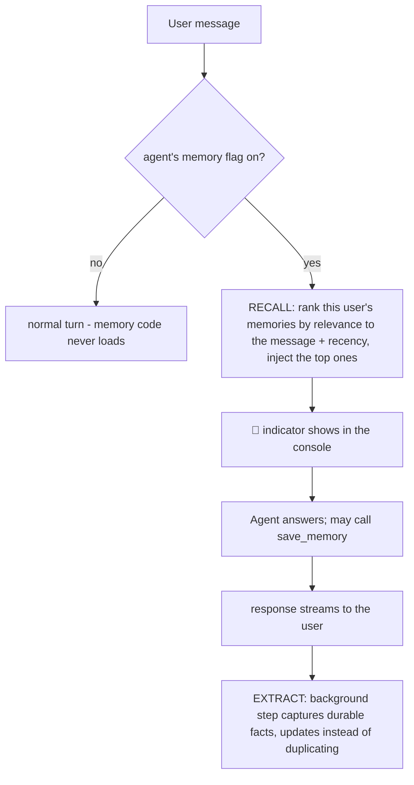

# Agent Memory for DIGIT
### Built, working, and verified live — a walkthrough

---

## One line

DIGIT agents can now **remember each user across conversations** — what you told them, how you like to work — stored in our existing Postgres, opt-in per agent, and smart about it: recall is ranked by *meaning*, and changed preferences *replace* old ones instead of piling up contradictions.

---

## The problem it solves

DIGIT stores chat history, but history belongs to one thread — open a new conversation and the agent knows nothing about you. The `semantic_memory_enabled` flag existed on every agent profile but was wired to nothing. This project is the system behind that flag.

**History ≠ memory:** history is the transcript of one conversation. Memory is a small set of durable facts about a user that follows them into *every new* conversation with that agent.

---

## What it does — as a user experiences it

1. **Teach it:** "Remember: I always want answers as three bullet points." → the agent visibly calls its `save_memory` tool; a row lands in the database.
2. **It survives:** restart the backend, open a **brand-new conversation**, ask anything → a small **🧠 Recalled 1 saved memory** indicator appears, and the answer comes back in three bullets.
3. **It's relevant, not just recent:** with several memories stored (formatting, team, "prefers Python examples"), ask "what language should this example use?" → it recalls the *Python* memory because it matches what you asked — not whatever was newest.
4. **Change your mind:** "Actually, five bullet points now, not three." → the tool answers *"Saved — this replaces an older memory on the same topic."* The old memory is retired **with a link to its replacement**, and new conversations follow the new preference.
5. **It's contained:** a different user gets nothing. A different agent gets nothing. An agent without the flag can neither read nor write memory — its behavior is byte-for-byte unchanged.
6. **It also learns quietly:** mention in passing that you work on payments reconciliation, and a background step captures it after the turn — no "remember" needed. (The visible tool and this automatic path are separate, and both are proven.)

Every step above was **verified live on the real backend** against the real Azure Postgres.

---

## How it works — five pieces

1. **Two tables in the existing Postgres.** The main one is an append-only log of memories — each row: the fact, which agent, which user, where it came from, timestamps. No new infrastructure anywhere.
2. **Recall.** At the start of a turn, the user's message is embedded (turned into a vector — a numeric representation of meaning) and memories are ranked by **relevance to the message blended with recency**, using **pgvector** — a vector extension already installed in our Postgres. The top memories are injected into the agent's instructions as clearly-labeled background data.
3. **The `save_memory` tool.** The agent's deliberate way to store something — a visible, auditable tool call. Every write passes a hygiene funnel: length cap, a filter that rejects credential/account-number-shaped content, and duplicate detection.
4. **Smart writes.** When a new fact collides with an old one, a small model decides: same thing (skip), new information (add), or **changed information — supersede**: the new row goes in, the old row is retired with a `superseded_by` link. Nothing is ever deleted, so the chain doubles as an audit trail of how a preference evolved.
5. **The switch.** All of it is gated by the per-agent `semantic_memory_enabled` flag, checked at every entry point. Off = the memory code isn't even imported.

---

## Design choices worth knowing (and defending)

- **Postgres + pgvector, no new infrastructure.** The extension was already installed on our server; memory adds two tables and columns, not systems.
- **Everything degrades safely.** Embedder down → recall falls back to recent-first. Decision model fails → the write becomes a plain add. Database hiccup → the turn proceeds without memory. **There is no code path where memory breaks a turn.**
- **Memory is subordinate to the user.** Recalled text is framed as background data — never instructions — and if it conflicts with what the user says now, the user wins. (A deliberate difference from single-user assistants.)
- **Calibrated from evidence, not guesses.** The write-gate emits one content-free telemetry line per write; the decision threshold was tuned from measured live values (a real changed-preference scored 0.309 similarity on our embedder — literature-derived thresholds would have missed it, and initially did).
- **Grounded in prior art.** The lifecycle follows Hermes Agent; the Postgres-rows substrate matches Letta; the extraction and update rules adapt mem0; the supersede-with-history pattern is Zep's enterprise approach. Sourced survey: `INDUSTRY_PRACTICES.md` (alongside this doc).

---

## Security & governance posture

- **Prompt-injection aware:** recalled memory is labeled as untrusted stored data; the block delimiter is stripped from content at write; entries are length-capped.
- **No sensitive data:** the capture step is instructed to skip credentials/secrets and sensitive personal data; a regex denylist backstops it; **memory content never appears in logs** (ids, counts, similarity scores only).
- **Right to forget:** deleting is a single soft-delete update today, plus a one-call "forget user" cascade. Industry-standard two-stage deletion (hide now, hard-purge on a policy schedule) is designed and proposed — the retention window is governance's call.
- **Auditability:** append-only + soft-delete + provenance (source, thread) + supersede chains = the audit trail is structural, not bolted on.
- **Approval-ready:** autonomous writes can route through DIGIT's existing tool-approval flow with one switch if desired.

---

## Status

| | |
|---|---|
| Core memory (save, recall, extraction, indicator, gating) | ✅ built, live-verified |
| Semantic retrieval (pgvector, relevance+recency) | ✅ built, live-verified |
| Update-instead-of-duplicate (supersede chains) | ✅ built, live-verified |
| Automated gates | ✅ 3 suites, all passing on the pod |
| Demo | ✅ rehearsable runbook, 9 beats |
| **Production review response** | see below |

### Production hardening (after the formal review)

The prototype was reviewed by the team lead, and the response was split into two merge candidates.

**Merge candidate 1 — foundation. Complete, in review.**

| | |
|---|---|
| Re-based onto current dev (branch `feature/agentmemory-v3`) | ✅ |
| Real migrations — Alembic, reviewed baseline, verified drift-free | ✅ |
| Harness-managed DB lifecycle — no private engine in-app | ✅ |
| Model-call conventions aligned with the harness's own | ✅ |
| Identity hardening — validated user **and** tenant, fail-closed | ✅ |
| Tests, including the guard that keeps memory off by default | ✅ |

**Merge candidate 2 — production behaviour. In progress.**

| | |
|---|---|
| Recalled memory out of the instruction channel, into the data channel | ✅ built, live-verified |
| Durable extraction — outbox table + background worker, survives restarts | ✅ built, live-verified |
| Governed APIs (view / delete / forget / disable), audit events, retention | next |
| Console tenant plumbing (re-enables memory for console traffic) | next |

---

## What's deliberately next (designed, not yet built)

1. **Governed memory APIs and retention** — user-facing view/delete/forget/disable with audit events on the harness's governance rails, retention windows, and the scheduled hard purge that completes the two-stage deletion story.
2. **Consolidation** — periodically fold many small memories into a compact per-user profile (the second table has been reserved for this from day one). Keeps injected context bounded forever.
3. **Phase 2: the self-improving skills loop** — the post-turn seam was built to be shared by a future reviewer that authors/refines skills from the same turns. Open design questions: durable skill storage and approval-gating (a skill changes behavior for all of an agent's users).

---

## Where the depth lives

- **`ARCHITECTURE.md`** (alongside this doc) — **start here for the whole system**: diagrams of the turn lifecycle, the write gate, the data model, the outbox, the identity gate, and the migration flow, plus configuration and failure-mode tables.
- **`TECHNICAL_DEEP_DIVE.md`** (alongside this doc) — the full as-built engineering reference: every file, every harness touch point, every decision and its rationale.
- **`INDUSTRY_PRACTICES.md`** (alongside this doc) — the sourced survey of how ChatGPT, Claude, Gemini, Letta, mem0, and Zep handle retention, vector retrieval, and updates — and what this design adopted from each.
- Further working documents (design records, demo runbooks, build history) live in the project working repository.
