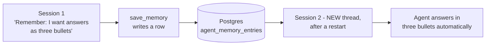

# Agent-Level Persistent Memory for DIGIT
### A working prototype — built, wired into the harness, and verified live

---

## In one line

DIGIT agents can now **remember a user's preferences and context across conversations** — stored in our existing Postgres, opt-in per agent, and demonstrably working end to end on the real backend.

---

## The problem

DIGIT persists chat history, but only *per thread*. Open a new conversation and the agent starts from zero — it can't carry a user's stated preferences, role, or working context forward. The `semantic_memory_enabled` profile flag existed but was inert. This prototype is the implementation behind that flag.

**Why it's not "just chat history":** history is the transcript of one thread. Memory is a small, curated set of facts that is re-injected into *every new* conversation. The demo proves it by recalling in a brand-new thread, after a restart.

---

## What it does

- The user tells an agent something durable → the agent saves it (a visible, auditable tool call).
- In any later conversation, that agent recalls it and tailors its response — shown live with a **🧠 Recalled N memories** indicator.
- **Scoped:** a different user, or a different agent, sees nothing. An agent with the flag off can't read or write memory at all.

---

## How it works (the shape)

We adapted the lifecycle from **Hermes Agent** (the open-source reference the team approved) and swapped its on-disk files for our Postgres. Four beats, every one gated by the per-agent flag:

| Beat | When | What happens |
|---|---|---|
| **Recall** | turn start | load the user's memories, inject into the agent's instructions, show the 🧠 indicator |
| **Save** | mid-turn | the agent calls a `save_memory` tool to store something (visible chip) |
| **Extract** | after the turn | a background step captures durable facts automatically |
| *(gate)* | always | flag off ⇒ none of it runs, the code doesn't even load |

**Footprint on the harness:** one new self-contained package plus ~5 small, flag-gated edits (instruction assembly, the post-turn seam, and one tool registration). Nothing changes for agents that don't opt in.

**Storage:** two new tables in the existing Azure Postgres. No new infrastructure. No vector database (deliberately — see roadmap).

---

## Design decisions, and why

- **Scoped per (agent, user).** Each agent remembers each user separately — matching the personalization goal. Cross-agent / user-wide memory was deferred as a bigger architectural question (per the planning meeting).
- **Opt-in per agent** via the existing flag — zero risk to agents that don't want it.
- **Postgres, not files or vectors.** Reuses what we have; the profile directory is ephemeral, the database is durable — which is exactly why memory belongs in the DB. Semantic/vector retrieval is a labeled future step, not on the critical path.
- **Memory is subordinate to live input.** Recalled memory is framed as background data the agent may use, never as instructions to obey — important on a shared, multi-user platform.
- **Grounded in prior art.** The design borrows deliberately from four production systems (Hermes, Letta, mem0, OpenClaw) rather than being invented — so the architecture is a known-good pattern.

---

## Security & governance posture (built in, not bolted on)

- **Prompt-injection aware:** recalled memory is framed as untrusted data; the block's delimiter is stripped from stored content; entries are length-capped.
- **No sensitive data:** the capture step is instructed to skip credentials/secrets, a regex denylist backstops it, and **memory content is never written to logs**.
- **Right to forget:** deletion is a single soft-delete UPDATE today; nothing is ever hard-erased, so the log is also an audit trail.
- **Approval-ready:** autonomous writes can be routed through DIGIT's existing tool-approval flow with one switch if governance wants human sign-off.

---

## Status: done and proven

| | |
|---|---|
| Code | ✅ package + harness wiring complete, on a feature branch |
| Automated checks | ✅ `PHASE_A: PASS` (7/7), `PHASE_B: PASS` |
| **Live acceptance** | ✅ save → restart → new-thread recall → scoping → flag-off → auto-extraction, all passing on the real backend |
| Recall indicator | ✅ verified live |
| Demo | ✅ rehearsable runbook ready |

One environmental note surfaced along the way (a stale pod env var overriding `.env` on the Azure endpoint) — diagnosed and fixed with no code change; worth flagging to the platform team.

---

## Roadmap — what's next (all designed-for, none built yet)

1. **User-model synthesis** — condense many entries into a compact "who is this user" profile (the reserved second table + `version` column already exist for it).
2. **Search-first retrieval** — when memory outgrows the injection budget, add a `search_memory` tool over Postgres full-text search — still no new infrastructure. Vectors only if FTS proves insufficient.
3. **Phase 2: the self-improving skills loop** — the post-turn seam we built is designed to be shared with a skills reviewer that writes/refines skills from the same turn. (Worth calibrating: Hermes' famous skills loop is *not* actually in its current code, so this would be designed fresh.)
4. **Governance items** — production DDL/migration path, retention policy, per-write audit events, an agent-facing forget tool. Each is a small, known addition.

---

## Want more depth?

- **`docs/TECHNICAL_DEEP_DIVE.md`** — every file, every edit, every decision, in full.
- **`docs/DEMO_WALKTHROUGH.md`** — the demo, step by step, with what you see at each moment.
- **`docs/research/REFERENCE_NOTES.md`** — source-level notes on the four systems we learned from.
